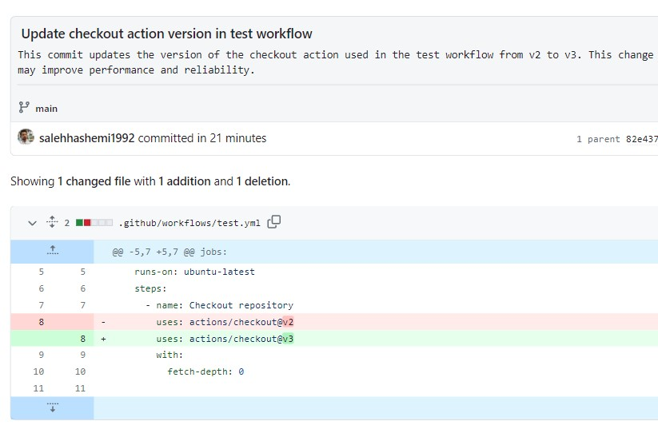
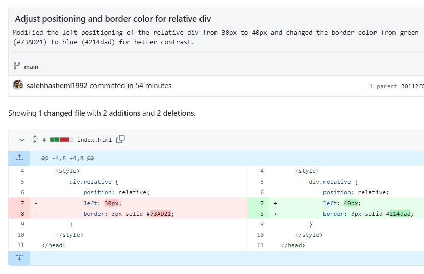

# AI Commit Message Generator GitHub Action

This GitHub Action automatically generates commit messages and descriptions for your commits using AI. 

When you make a commit with the title [ai], this action will analyze the commit changes, use AI to generate a commit title and description, and update the commit message accordingly.

### Sample Output



## Features
* Automatically generates meaningful commit titles and descriptions for your commits
* Utilizes AI to analyze commit changes and generate relevant commit messages
* Maintains the original author of the commit (committer name and email)

## Usage
To use this action in your GitHub repository, follow these steps:

1. Add a secret named `OPENAI_API_KEY` in your GitHub repository containing your OpenAI API key.

2. Add the following workflow file to your repository in the .github/workflows directory, and name it ai_commit_message.yml:

```bash
name: AI Commit Message Generator

on: [push]

jobs:
  ai_commit_message:
    runs-on: ubuntu-latest
    permissions:
      contents: write
    steps:
      - name: Checkout repository
        uses: actions/checkout@v3
        with:
          fetch-depth: 0

      - name: Replace commit message with AI-generated title
        uses: salehhashemi1992/ai-commit-message@v0.3.0
        env:
          OPENAI_API_KEY: ${{ secrets.OPENAI_API_KEY }}
          OPENAI_MODEL: gpt-3.5-turbo # Optional, you can use 'gpt-4' or 'gpt-4-32k' as well.

```

Now, whenever you push a commit with the title [ai], this action will automatically generate a commit title and description using AI and update the commit message accordingly.

## Configuration
You can customize the behavior of this action using the following environment variables:

### OPENAI_API_KEY
Required. The API key for accessing the OpenAI API.

### OPENAI_MODEL
Optional. The OpenAI model you want to use.

Supported values are 'gpt-3.5-turbo', 'gpt-4', and 'gpt-4-32k'. Defaults to 'gpt-3.5-turbo'.

### Known Bugs
If you push a new commit before the title of the last commit has been updated, it will result in an issue where only the last commit title gets updated. To avoid this problem, please make sure to wait for the previous commit's title to be updated before pushing a new commit.

### Changelog

Please see [CHANGELOG](CHANGELOG.md) for more information what has changed recently.

## Contributing

Please see [CONTRIBUTING](CONTRIBUTING.md) for details.

## Credits

-   [Saleh Hashemi](https://github.com/salehhashemi1992)
-   [All Contributors](../../contributors)

## License

The MIT License (MIT). Please see [License File](LICENSE) for more information.